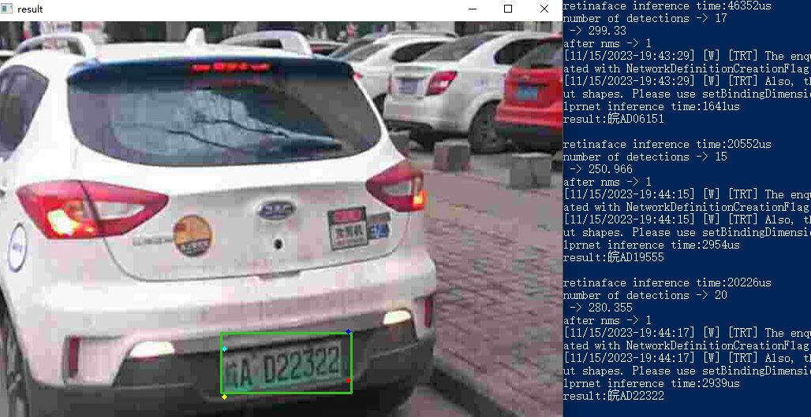

**[English](readme.md), [中文](readme_zh.md)**

## Plate type supported

Chinese license plate (single-line and double-line)

## Environment
### PC
Windows 10

python 3.7.10

CUDA 11.7

cuDNN 8.6.0.163

TensorRT 8.5.1.7

OpenCV 4.6.0 (build from source)

CMake 3.26.5

Visual Studio 16 2019

### Jetson Nano
python 3.6.9

Jetpack 4.6.2

CUDA 10.2.89

cuDNN 8.2.1.32

TensorRT 8.2.1.8

OpenCV 4.5.2 with GStreamer support

## Requirements
### PC
albumentations==1.3.1

imutils==0.5.4

matplotlib==3.3.4

numpy==1.21.6

opencv_python==4.8.1.78

opencv_python_headless==4.8.1.78

Pillow==9.5.0

pycuda==2021.1+cuda115

pytorch_lightning==1.8.0

PyYAML==5.4.1

task==0.2.5

termcolor==2.3.0

torch==1.13.1+cu116

torchvision==0.14.1+cu116

### Jetson Nano
albumentations==1.3.1

imutils==0.5.4

matplotlib==3.3.2

numpy==1.16.1

Pillow==10.1.0

pycuda==2021.1

pytorch_lightning==1.5.0

PyYAML==6.0.1

task==0.2.5

termcolor==1.1.0

torch==1.6.0a0+b31f58d

torchvision==0.9.0a0+01dfa8e

## How to use
### Run PyTorch demo on PC:
run demo_torch.py

### Run TensorRT demo on PC (python):
#### step 1
clone the project and follow the instructions to build Retinaface trt engine:

https://github.com/zxm97/Pytorch_Retina_License_Plate_trt
#### step 2
clone the project and follow the instructions to build LPRNet trt engine:

https://github.com/zxm97/license-plate-recoginition_trt

#### step 3
run demo_trt.py / demo_trt_fpn_reduced.py / demo_trt_fpn_reduced_async.py

 - demo_trt.py is for original RetinaFace model
 - demo_trt_fpn_reduced.py is for the modified RetinaFace model (1 layer of FPN is reduced)
 - demo_trt_fpn_reduced_async.py is for the modified RetinaFace model (1 layer of FPN is reduced). Speed up by dividing the task into threads.
  
### Run TensorRT demo on PC (C++):

#### step 1
clone the project and run gen_wts_for_tensorrtx.py to get weight map file:
https://github.com/zxm97/Pytorch_Retina_License_Plate_trt
#### step 2

open xxx\Project_cpp\CMakeLists.txt，modify OpenCV_DIR and TRT_DIR。

open CMake (GUI)

set source code directory : xxx/Project_cpp

set binaries directory : xxx/Project_cpp/build

click Configure, Generate and Open Project

#### step 3
 select Release x64, build solution for decodeplugin, create xxx\Project_cpp\build\Release\decodeplugin.lib

#### step 4
build solution for retina_mnet_plate

move the weight map file in step 1 to xxx\Project_cpp\build\Release

open Windows PowerShell, run the following command to build RetinaFace trt engine:

`./retina_mnet_plate.exe -s`

#### step 5
clone the project and follow the instructions to build LPRNet trt engine:

https://github.com/zxm97/license-plate-recoginition_trt

move LPRNet trt engine file to xxx\Project_cpp\build\Release

#### step 6
build solution for demo

run the following command to detect and recognize plates on images:

`./demo.exe -d`

### Run TensorRT demo on Jetson Nano (python):

#### step 1
clone the project and follow the instructions to build Retinaface trt engine (use the modified model with 1 FPN layer reduced):

https://github.com/zxm97/Pytorch_Retina_License_Plate_trt
#### step 2
clone the project and follow the instructions to build LPRNet trt engine:

https://github.com/zxm97/license-plate-recoginition_trt

#### step 3
run demo_trt_fpn_reduced_async.py

 - Speed up by dividing the task into threads
 - To lower CPU usage, use hardware acceleration for decoding.
 - Up to 20 frames per second for a 1258 x 684 h.264 video

## References

https://github.com/gm19900510/Pytorch_Retina_License_Plate

https://github.com/ChHanXiao/license-plate-recoginition

https://github.com/1996scarlet/faster-mobile-retinaface

https://github.com/wang-xinyu/tensorrtx

https://github.com/SunlifeV/CBLPRD-330k

https://github.com/yxgong0/CRPD
